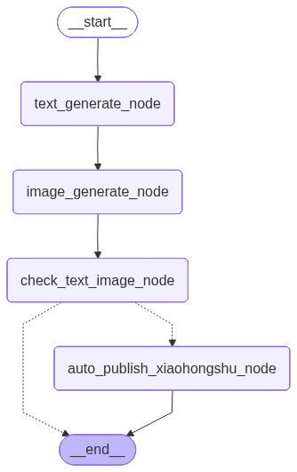
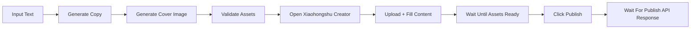

# Xiaohongshu Auto Publisher

<div align="center">

[](https://www.python.org/)
[](https://fastapi.tiangolo.com/)
[](https://playwright.dev/)
[](https://www.deepseek.com/)
[](https://dashscope.aliyun.com/)
[](https://opensource.org/licenses/MIT)

输入一个主题文本，自动生成小红书文案、配图，并通过浏览器完成图文发布。

</div>

<div align="center">
  
</div>

## Overview

这是一个面向小红书图文场景的自动化发布项目，目标是把这条链路打通：

`主题输入 -> 文案生成 -> 配图生成 -> 页面上传 -> 自动发布`

当前版本已经支持：

- Web 前端输入主题文本
- DeepSeek 生成小红书文案
- Qwen 生成封面配图
- Playwright 驱动小红书创作页真实发布
- 登录态本地复用
- 同主题缓存文案和图片，减少重复耗时
- 发布前等待素材稳定，降低“点早了没发出去”的概率
- 发布时等待真正的发布接口响应，不再只看页面提示词

## Highlights

| 模块 | 当前能力 | 说明 |
| --- | --- | --- |
| Web 页面 | 已完成 | 用户在页面输入主题即可触发整条流程 |
| 文案生成 | 已完成 | 生成标题、正文、场景/地点 |
| 图片生成 | 已完成 | 生成适合小红书封面的图片 |
| 自动发布 | 已完成 | 自动上传图片、填充正文、点击发布 |
| 登录态复用 | 已完成 | 首次登录后保存到本地 |
| 缓存提速 | 已完成 | 相同输入 1 小时内复用文案和图片 |
| 成功判断 | 已增强 | 通过真实发布接口返回判断，而非只看页面文案 |

## Quick Start

### 1. 安装依赖

```bash
pip install -r requirements.txt
playwright install chromium
```

### 2. 配置模型密钥

参考 [`.env.example`](./.env.example) 在仓库根目录创建 `.env`：

```env
DEEPSEEK_API_KEY=your_deepseek_api_key
DEEPSEEK_BASE_URL=https://api.deepseek.com/v1
DEEPSEEK_MODEL=deepseek-chat

QWEN_API_KEY=your_qwen_api_key
QWEN_IMAGE_MODEL=qwen-image-2.0-pro
DASHSCOPE_BASE_URL=https://dashscope.aliyuncs.com/api/v1

QWEN_IMAGE_SIZE=1024*1024
QWEN_PROMPT_EXTEND=false
```

### 3. 启动 Web 页面

PowerShell:

```powershell
.\start_web.ps1
```

或手动启动：

```bash
D:\AnaConda\python.exe -m uvicorn webapp:app --host 127.0.0.1 --port 8000 --reload
```

打开：

[http://127.0.0.1:8000](http://127.0.0.1:8000)

在页面中输入主题，例如：

```text
请发一个关于TK跨境电商的小红书
```

## Product Experience

### Web 入口

项目新增了一个前端页面，用户可以直接：

- 输入主题文本
- 点击按钮启动自动发布
- 查看生成标题、正文、地点
- 查看生成图片预览
- 查看发布结果
- 查看当前是否已有登录态

### 首次发布

首次真实发布时，程序会在本机打开浏览器进入小红书创作页。

你需要：

- 完成一次小红书登录
- 等待页面自动继续

登录态会保存到：

```text
cookie/xiaohongshu_state.json
```

后续会自动复用，不需要重复登录。

## Workflow

### 运行顺序

1. 用户输入主题文本
2. 文案节点生成标题、正文和场景
3. 图片节点生成封面图
4. 审核节点检查标题、正文和图片是否满足要求
5. Playwright 打开小红书创作页
6. 上传图片并填充图文
7. 等待图片上传完成并稳定
8. 点击发布
9. 等待真正的发布接口响应

### Mermaid 流程图



## Performance

### 当前已做的提速优化

- 默认只走顺序执行，不再先跑 LangGraph 再回退重跑
- 对同一主题做文案与图片缓存
- 缩短无意义的固定等待
- 发布前增加“素材稳定”检测，减少失败重试带来的二次耗时
- 图片生成改成更短、更聚焦的 prompt

### 为什么有时还是会慢

通常最慢的是这三步：

- LLM 生成文案
- 图片模型生成图片
- 小红书页面上传图片与页面处理

如果你连续使用相同主题，缓存会明显减少等待时间。

## Reliability

### 之前为什么会出现“显示成功但账号里没有”

早期版本会把页面上的一些常驻文案误当成成功信号，例如侧边栏里的管理入口。

现在已经调整为：

- 优先等待真正的发布接口请求
- 解析发布接口的返回状态
- 只有检测到明确的成功结果才认为真的发布成功

### 当前仍然可能失败的原因

由于这是浏览器自动化方案，不是小红书官方开放平台直连，因此仍然会受这些因素影响：

- 页面 DOM 结构变化
- 登录态失效
- 图片仍在处理
- 页面校验规则调整
- 网络波动

## Project Structure

```text
.
├── __000__demo/                              # 早期示例代码
├── __001__langgraph_translate_demo/          # LangGraph 学习示例
├── __002__auto_publish_xiaohongshu/          # 自动发布主流程
│   ├── agent_state.py
│   ├── langgraph_auto_publish_xiaohongshu.py
│   └── nodes/
│       ├── text_generate_node.py
│       ├── image_generate_node.py
│       ├── check_text_image_node.py
│       └── auto_publish_xiaohongshu_node.py
├── common/                                   # 配置、模型、缓存工具
│   ├── config.py
│   ├── llm.py
│   ├── image_generate_utils.py
│   ├── workflow_cache.py
│   ├── langgraph_utils.py
│   └── path_utils.py
├── web/                                      # 前端页面
│   ├── index.html
│   └── assets/
│       ├── app.js
│       └── styles.css
├── webapp.py                                 # FastAPI 入口
├── start_web.ps1                             # 一键启动脚本
├── picture/                                  # 生成图片目录
├── cookie/                                   # 登录态与缓存
├── test.py                                   # Playwright 调试脚本
├── requirements.txt
└── .env.example
```

## Command Line Usage

如果你不想通过前端页面，也可以直接命令行运行：

```bash
python __002__auto_publish_xiaohongshu/langgraph_auto_publish_xiaohongshu.py "请发一个关于TK跨境电商的小红书"
```

或者：

```bash
python __002__auto_publish_xiaohongshu/langgraph_auto_publish_xiaohongshu.py
```

然后手动输入主题。

## FAQ

<details>
<summary><strong>运行时报错找不到浏览器</strong></summary>

执行：

```bash
playwright install chromium
```

</details>

<details>
<summary><strong>点击发布后账号里没有内容</strong></summary>

通常说明：

- 页面按钮被点击了，但真实发布接口没有成功返回
- 或者图片仍在处理，导致页面并未真正进入可发布状态

当前版本已经增加：

- 发布前等待素材稳定
- 真实发布接口响应检测

</details>

<details>
<summary><strong>文案内容和主题不符</strong></summary>

建议把主题写得更明确，例如：

- 不推荐：`发一个小红书`
- 推荐：`请发一个关于TK跨境电商新手入门的小红书`

</details>

<details>
<summary><strong>图片生成太慢</strong></summary>

可以尝试：

- 重复使用相同主题，让缓存生效
- 调整 `.env` 中的 `QWEN_IMAGE_SIZE`
- 保持 `QWEN_PROMPT_EXTEND=false`

</details>

## Roadmap

- 发布历史列表
- 前端页面显示缓存命中提示
- 发布成功后二次校验笔记列表
- 定时发布
- 多平台扩展

## License

MIT
